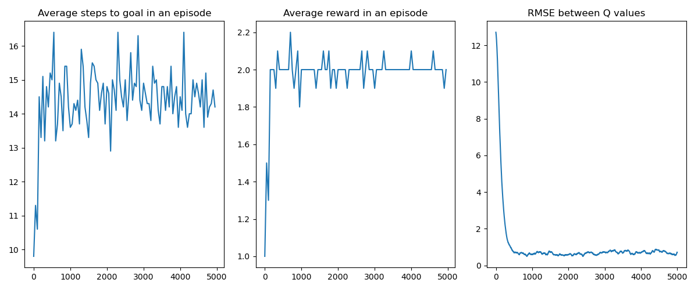
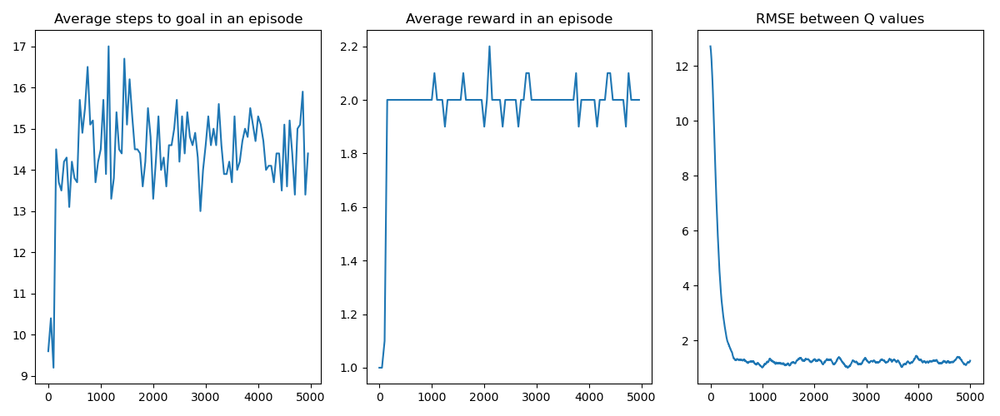
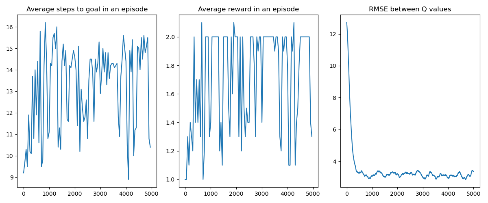
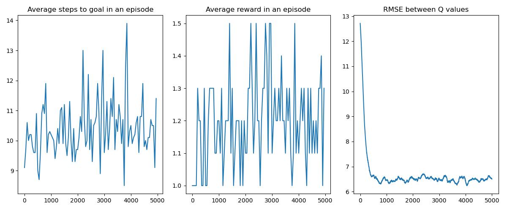
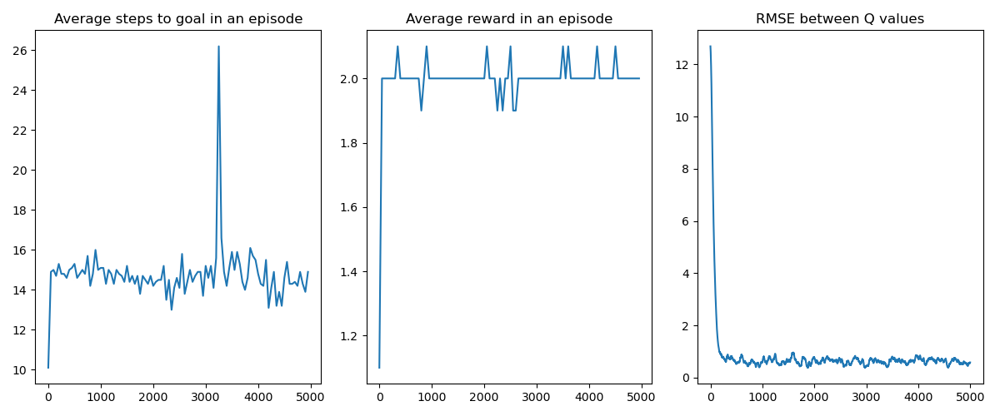
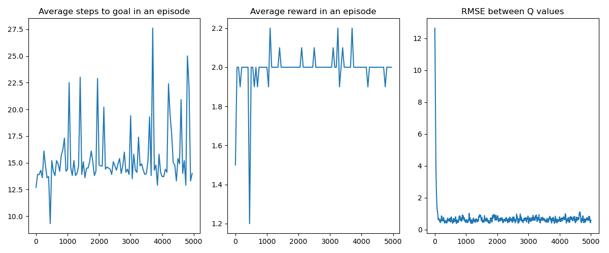
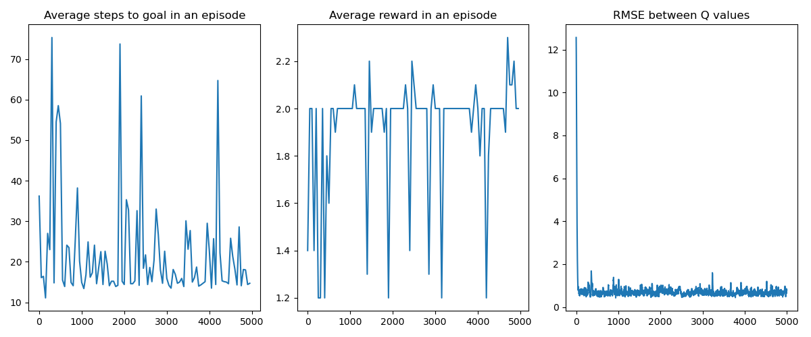

# Introduction
In this project, I implemented reinforcement learning methods including value iteration, Q-learning and policy gradient on a variety of environments. Reproducible code is available as a [git repository](https://github.com/fyng/SLAM)

# Maze
Given an maze, determine the optimal policy (next move given current location in the maze) to 1) maximize the number of flags captured while 2) reaching the end as quickly as possible

The maze is a 4x5 grid, where a square can be empty contains obstables, or flags. There is a designated starting and goal square. The agent can take a step at every timepoint (UP, DOWN, LEFT, RIGHT). There is a 0.1 probability that the agent slips and take the next counterclockwise action (e.g. if slipped while going UP, go RIGHT instead). When the agent encounters an obstacle, it bounces back to its current square. 

## Approach 1: Value Iteration
Starting from a state $s$, the optimal value of the state $s$ can be calculated deterministically as a function of the optimal value of the next state $s'$ and the action taken $a$, using the Bellman Equation. 
$$V(s) = \max_a \sum_{s', r} p(s',r|s,a)[\gamma V(s') + R(s,a)]$$

The challenge is that the optimal value of the next state $V(s')$ is unknown. Luckily and perhaps surprisingly, we can randomly initialize $V(s) \forall s \in S$, and iteratively update each $V(s)$. Given sufficient iterations, this is guaranteed to converge to the optimal value function $V^{*}(s)$.

Once the optimal value function $V^{*}(s)$ is found, the optimal Q-function $Q^{*}(s,a)$ can be found by exploring all possible action starting from state $s: a \in A(s)$ and calculating the optimal value for each state-action pair $(s,a)$. This can be achieved by performing a single forward pass over all states, and the permissable action from each state. 

## Results
Taking a discount factor of $\gamma = 0.9$, the optimal policy will produce the following trajectory:
START -> DOWN -> RIGHT -> RIGHT -> UP -> DOWN -> RIGHT -> DOWN -> DOWN -> UP -> UP -> RIGHT -> UP -> GOAL

The Q-function that produced this set of trajectory is in `Qval.npy`.

> The effect of discount factor $\gamma$:
> We choose the hyperparameter $\gamma \in (0,1)$, which is a discount factor on future value in order to force finite trajectories. In the problem statement we used $\gamma=0.9$, and the corresponding trajectory captured *2 flags*
> It is important to note that this is result is not agnostic to parameter choice. E.g. choosing a less aggressive discount $\gamma = 0.99$ will yield a trajectory that captures *all 3 flags*. This is an intuitive result since the future reward is valued higher. 

## Approach 2: Q-learning
Instead of iteratively updating the value function $V(s)$, Q-learning updates the Q-function $Q(s,a)$. Here I implement $\epsilon$-greedy Q-learning: instead of performing the best action according to the Q-function, the agent has some small probability $\epsilon$ of takes a random step instead. Intuitively, the agent "exploits" the best action $1-\epsilon$ of the time and "explores" $\epsilon$ of the time. 

While value iteration updates the value function $V(s)$ purely based on the next state, Q-learning performs a *weighted* update of $Q(s,a)$, parameterized by a learning rate $\alpha$. 
$$ Q(s_t, a_t) = (1- \alpha)Q(s_t, a_t) + \alpha[r_{t+1} + \gamma \max_aQ(s_{t+1},a)]$$

## Results: 
In general, a small $\epsilon$ and learning rate leads to effective convergence. The Q-function learned via Q-learning is close to the optimal $Q^{*}$, and the agent reliably reaches the goal with 2 flags in 12 steps.

### $\epsilon$ greedy parameter
| lr=0.1, eps=0.05 | lr=0.1, eps=0.1 | lr=0.1, eps=0.25 | lr=0.1, eps=0.5 |
:-------------------------:|:-------------------------:|:-------------------------:|:-------------------------:
  |   |   |  

A small value of $\epsilon$ is desirable for speeding up convergence, and exploration of alternative trajectories (indicated by some agents reaching the goal with 3 flags instead of the optimal 2 flags). When $\epsilon$ is set too large, Q-learning has difficulty reaching convergence and there is a large oscillation in average reward, and number of steps taken to reach the goal.

### Learning rate parameter
| lr=0.1, eps=0.05 | lr=0.2, eps=0.05 | lr=0.4, eps=0.05 | lr=0.6, eps=0.05 |
:-------------------------:|:-------------------------:|:-------------------------:|:-------------------------:
  |   |   |  

Similarly, when the learning rate is too large, Q-learning has difficulty converging. In general, when learning rate increases, there is a larger variance in the number of steps taken to reach the goal. When lr = 0.6, large updates to the Q-function can cause it to fall into a worse solution and reach the goal with only 1 flag.

# Gym 

## Q-learning

## REINFORCE

