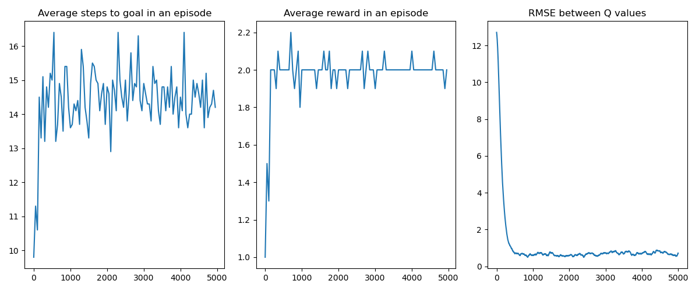
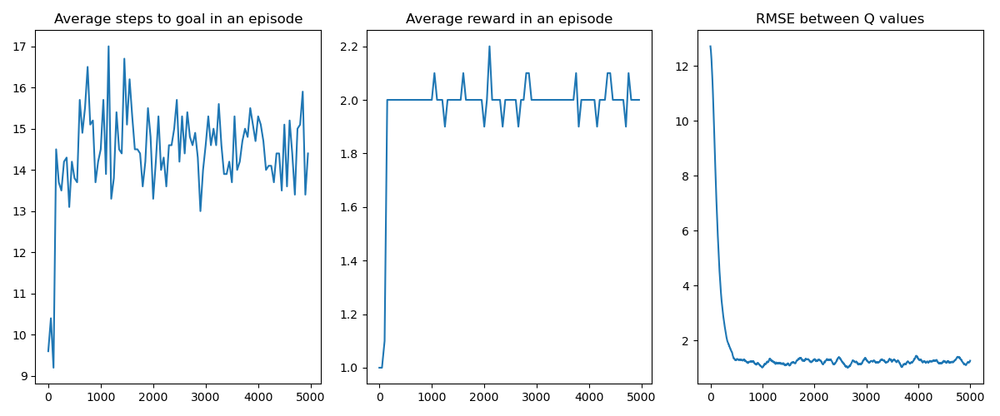
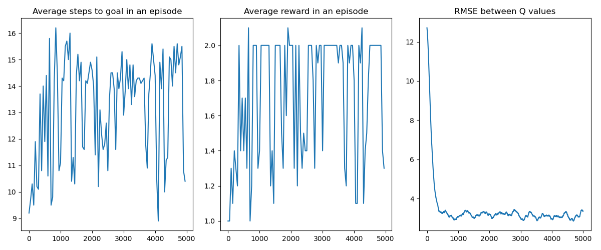
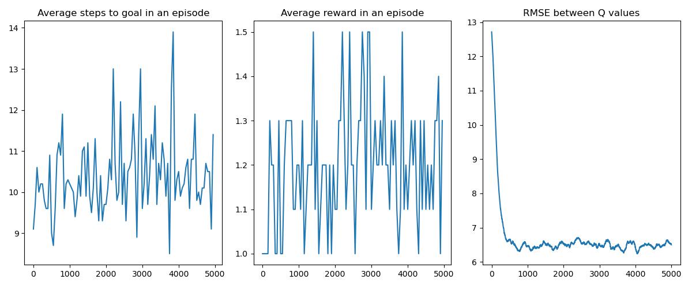
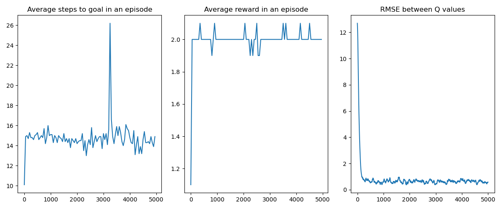
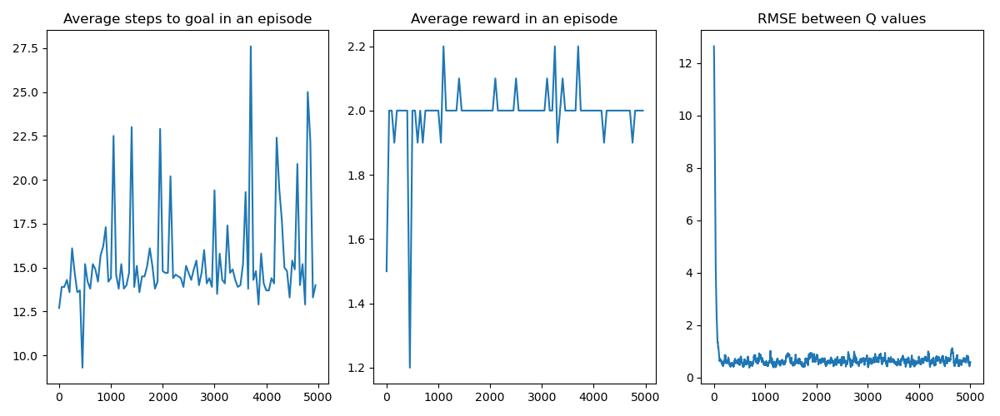
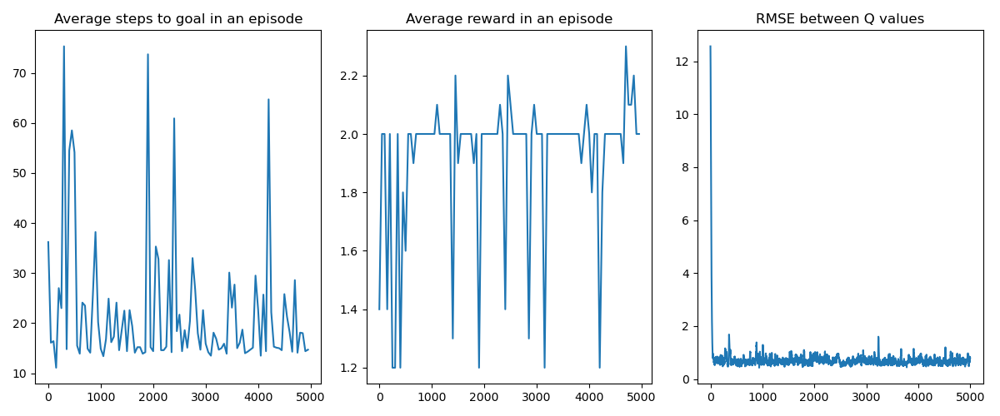
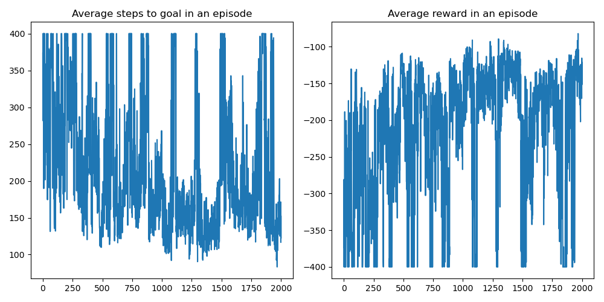
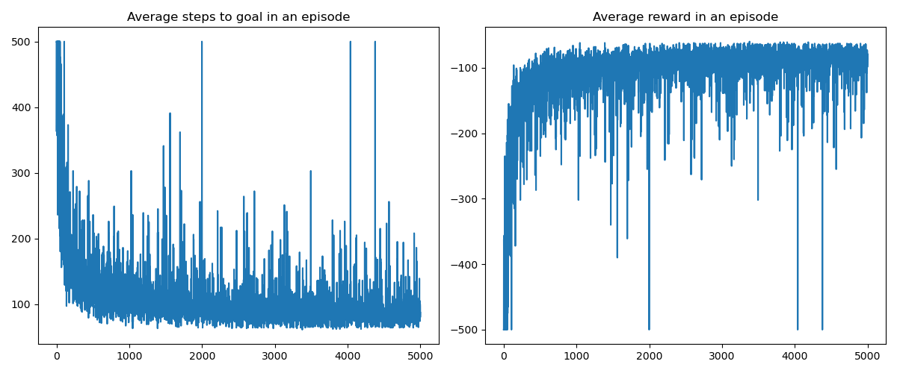
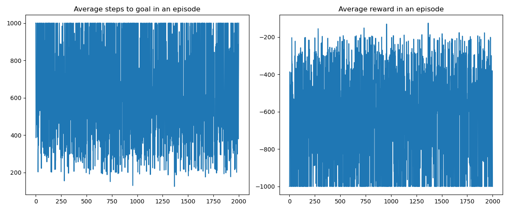

# Introduction
In this project, I implemented reinforcement learning methods including value iteration, Q-learning and policy gradient on a variety of environments. Reproducible code is available as a [git repository](https://github.com/fyng/SLAM)

# Maze
Given an maze, determine the optimal policy (next move given current location in the maze) to 1) maximize the number of flags captured while 2) reaching the end as quickly as possible

The maze is a 4x5 grid, where a square can be empty contains obstables, or flags. There is a designated starting and goal square. The agent can take a step at every timepoint (UP, DOWN, LEFT, RIGHT). There is a 0.1 probability that the agent slips and take the next counterclockwise action (e.g. if slipped while going UP, go RIGHT instead). When the agent encounters an obstacle, it bounces back to its current square. 

## Approach 1: Value Iteration
Starting from a state $s$, the optimal value of the state $s$ can be calculated deterministically as a function of the optimal value of the next state $s'$ and the action taken $a$, using the Bellman Equation. 
$$V(s) = \max_a \sum_{s', r} p(s',r|s,a)[\gamma V(s') + R(s,a)]$$

The challenge is that the optimal value of the next state $V(s')$ is unknown. Luckily and perhaps surprisingly, we can randomly initialize $V(s) \forall s \in S$, and iteratively update each $V(s)$. Given sufficient iterations, this is guaranteed to converge to the optimal value function $V^{*}(s)$.

Once the optimal value function $V^{*}(s)$ is found, the optimal Q-function $Q^{*}(s,a)$ can be found by exploring all possible action starting from state $s: a \in A(s)$ and calculating the optimal value for each state-action pair $(s,a)$. This can be achieved by performing a single forward pass over all states, and the permissable action from each state. 

## Results
Taking a discount factor of $\gamma = 0.9$, the optimal policy will produce the following trajectory:
START -> DOWN -> RIGHT -> RIGHT -> UP -> DOWN -> RIGHT -> DOWN -> DOWN -> UP -> UP -> RIGHT -> UP -> GOAL

The Q-function that produced this set of trajectory is in `Qval.npy`.

> The effect of discount factor $\gamma$:
> We choose the hyperparameter $\gamma \in (0,1)$, which is a discount factor on future value in order to force finite trajectories. In the problem statement we used $\gamma=0.9$, and the corresponding trajectory captured *2 flags*
> It is important to note that this is result is not agnostic to parameter choice. E.g. choosing a less aggressive discount $\gamma = 0.99$ will yield a trajectory that captures *all 3 flags*. This is an intuitive result since the future reward is valued higher. 

## Approach 2: Q-learning
Instead of iteratively updating the value function $V(s)$, Q-learning updates the Q-function $Q(s,a)$. Here I implement $\epsilon$-greedy Q-learning: instead of performing the best action according to the Q-function, the agent has some small probability $\epsilon$ of takes a random step instead. Intuitively, the agent "exploits" the best action $1-\epsilon$ of the time and "explores" $\epsilon$ of the time. 

While value iteration updates the value function $V(s)$ purely based on the next state, Q-learning performs a *weighted* update of $Q(s,a)$, parameterized by a learning rate $\alpha$. 
$$ Q(s_t, a_t) = (1- \alpha)Q(s_t, a_t) + \alpha[r_{t+1} + \gamma \max_aQ(s_{t+1},a)]$$

## Results: 
In general, a small $\epsilon$ and learning rate leads to effective convergence. The Q-function learned via Q-learning is close to the optimal $Q^{*}$, and the agent reliably reaches the goal with 2 flags in 12 steps.

### $\epsilon$ greedy parameter
| lr=0.1, eps=0.05 | lr=0.1, eps=0.1 | lr=0.1, eps=0.25 | lr=0.1, eps=0.5 |
:-------------------------:|:-------------------------:|:-------------------------:|:-------------------------:
  |   |   |  

A small value of $\epsilon$ is desirable for speeding up convergence, and exploration of alternative trajectories (indicated by some agents reaching the goal with 3 flags instead of the optimal 2 flags). When $\epsilon$ is set too large, Q-learning has difficulty reaching convergence and there is a large oscillation in average reward, and number of steps taken to reach the goal.

### Learning rate parameter
| lr=0.1, eps=0.05 | lr=0.2, eps=0.05 | lr=0.4, eps=0.05 | lr=0.6, eps=0.05 |
:-------------------------:|:-------------------------:|:-------------------------:|:-------------------------:
  |   |   |  

Similarly, when the learning rate is too large, Q-learning has difficulty converging. In general, when learning rate increases, there is a larger variance in the number of steps taken to reach the goal. When lr = 0.6, large updates to the Q-function can cause it to fall into a worse solution and reach the goal with only 1 flag.

# Gym 
We explore two toy environments using the [Farama Gymnasium](https://gymnasium.farama.org/README/) (previously OpenAI Gym) API. The environment used are `Acrobot-v1` and `MountainCar-v0`. 

### `Acrobot-V1`
[This environment](https://gymnasium.farama.org/environments/classic_control/acrobot/#acrobot) contains a double jointed arm, suspected from verticle position. The reinformement learning problem is to train a policy that applies torque at the middle joint at each time point, such that the arm swings above a certain height. This presents an underactuated robots environment.

### `MountainCar-v0`
[This environment](https://gymnasium.farama.org/environments/classic_control/mountain_car/) contains a car on a sinosidal hill, and the goal is to learn a policy that accelerates the car leftwards or rightwards at each timestep, such that the car reaches the goal position (a hill on the right).

## Q-learning
The same Q-learning update rule is implemented like the Maze. Unlike the maze, we do not iterate over all the possible states in each forward pass. Using the Gym API, we instead iterate through each episode to termination, and perform stochastic update over the state space that is encountered while applying the learned $\epsilon$-greedy policy. 

While the action space is discrete for both environments, the state space for both is continous, which presents a challenge compared to the Maze problem. To discretize the state space, I divided each state into $n$ evenly-sized bins, therefore an environment with $m$-dimensional continous states will have an $n \times m$ state space matrix, and a $(n \times m, a)$ sized Q-function. I chose $n=2$ for both problems since the the optimal policy for appling force/acceleration is only dependent on the sign of the position and velocity in each problem (left v.s. right).

During experimentation, I found that a learning rate decay and $\epsilon$ decay schedule is helpful for encouraging the policy to converge. The best learning curves for each problem are shown below with their respective parameters:

`Acrobot-V1` | `MountainCar-v0`
:-------------------------:|:-------------------------:
  |   
initial lr = 0.1, lr decay = 0.85, lr decay interval = 100 | initial lr = 5e-8, lr decay = 0.85, lr decay interval = 100
initial $\epsilon$ = 0.05, $\epsilon$ decay = 0.85,  $\epsilon$ decay interval = 100| initial $\epsilon$ = 0.05, $\epsilon$ decay = 0.85,  $\epsilon$ decay interval = 100
$\gamma$ = 0.99 | $\gamma$ = 0.99

## REINFORCE
REINFORCE is an example of a policy gradient method. Compared to Q-learning, which learns an optimal Q-function, policy gradient methods directly update a policy $\pi$ parameterized by $\theta$, *without explicitly learning the Q-function*. This is useful because the Q-function can quickly become unmanagable for a complex problem with multiple-dimension state representation: for `Acrobot-V1`, discretizing each dimension of the state space into 10 bins will produce a $(10^6, a)$ Q-function, even for a trivial problem. 

Using policy gradient methods, we can reduce the search space to an abitrary $d$-dimensional $\theta$ parameterization of the policy. Here, I used a simple linear model with a $d_{output} \times d_{input}$ weight matrix, although a simple multilayer perceptron can easily be fitted. Another advantage of policy gradient methods is that we can apply well-studied gradient descend (ascend) algorithms for optimization. My implementation uses the PyTorch framework, which takes care of the gradient calculations and allow us to leverage well-optimized gradient descend methods like Adam.

Unfortunately learning the optimal gradient step is not possible as it requires knowing all possible trajectories. Instead, we perform a Monte-Carlo estimate of the optimal gradient step by repeatedly sampling a trajectory (a sequence of states and actions across a episode) using the current policy $\pi_\theta$, then updating the policy with gradient calculated from the discounted future reward, for each state-action pair $(s_i, a_i)$. In Sutton & Barlo, it is shown the sample gradient is the same *in expectation* to the optimal gradient, therefore making it a good estimator. 

Suppose some episode sampled produced a T-length trajectory $(s_0, a_0, r_1, ..., s_{T-1}, a_{T-1}, r_T)$. Then for each state action pair $(s_t, a_t), \quad t \in 0,1,..,T-1$:
$$\text{Discounted future reward:} \quad G_{s_t} = \sum_{k=t+1}^T \gamma^{k-t-1}$$

We can add an arbitrary baseline function $b(s_t)$ to the discounted future reward $G$ as long as it is not a function of the action taken, since it does not change the expectation of the sample gradient. Here, I used a baseline of the running average of the previous 10 rewards. This helps to reduce the variance between gradient updates from each time point. The gradient update, including the baseline, is parameterized by a learning rate $\alpha$ and the discount factor $\gamma$:
$$\theta_{t+1} = \theta_t + \alpha \gamma^t (G-b_{s_t}) \nabla \ln \pi_\theta(s_t, a_t)$$

In practice, I also rescale the value of each state dimension to (-1,1), in order to ensure learning along all dimensions of the state space. Since reward is sparse for `MountainCar-v0`, every action sampled is performed for 5 consequtive steps to improve the odds of reaching the top of the mountain (rather than left and right accelerations caneling each other out).

The optimal learning curves for each environment is below. However, it was difficult to get `MountainCar-v0` to converge to a good policy:

`Acrobot-V1` | `MountainCar-v0`
:-------------------------:|:-------------------------:
  |   
$\alpha$ = 0.01, $\gamma$ = 0.99$ | $\alpha$ = 3e-8, $\gamma$ = 0.95